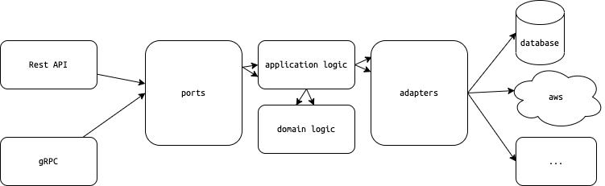

# Wild Workout
This project is build to:
- solve the real life microservice problem 

## Table of contents
- [Wild Workout](#wild-workout)
  - [Table of contents](#table-of-contents)
  - [How to get up and running](#how-to-get-up-and-running)
    - [Before you begin, make sure you have:](#before-you-begin-make-sure-you-have)
    - [Install packages](#install-packages)
    - [Create `secret.yaml`](#create-secretyaml)
    - [Bootstrap project](#bootstrap-project)
    - [Start services](#start-services)
    - [Install VScode extensions](#install-vscode-extensions)
  - [How to create new service](#how-to-create-new-service)
    - [Generate diagram (not implemented)](#generate-diagram-not-implemented)
  - [How to test](#how-to-test)
    - [Unit test](#unit-test)
    - [Integration test](#integration-test)
    - [End-to-End test](#end-to-end-test)
  - [How to deploy](#how-to-deploy)
  - [Directories](#directories)
  - [Technologies](#technologies)
  - [Service Architecture](#service-architecture)
  - [Hacking](#hacking)

## How to get up and running

### Before you begin, make sure you have:

1. The latest version of `git` is installed
2. The latest version of `docker` is installed
3. The latest version of `go` is installed
4. The buf tool `buf:^1.17.x` is installed
5. the oapi-codegen tool `deepmap/oapi-codegen:^v1.12.x` is installed


### Install packages

### Create `secret.yaml`
In each service, we have `secret.example.yaml` to list down all the needed secrets. In order to make service up and running we have to create `secret.yaml`

### Bootstrap project

```shell
make bootstrap
```

### Start services

```shell
docker compose up
```

### Install VScode extensions

[redocly](https://marketplace.visualstudio.com/items?itemName=Redocly.openapi-vs-code)

## How to create new service
1. You create a service inside internal folder
2. If the service have input logic(http, gRPC) create definition files at `api` folder then you can generate server logic by this files
3. Using existing packages inside `internal/common` 
4. Update Makefile for latter usage

### Generate diagram (not implemented)

## How to test
### Unit test
We must write unit test for each peace of domain and application logic. This test must not depends on other components of the application if you follow clean architecture.
- Using VScode Go extension to generate template for file
- Using mock when application logic depend on other components


### Integration test
An integration test is a test that checks if an adapter works correctly with an external infrastructure
### End-to-End test
Using postman or another tool to test the whole application
## How to deploy
<!-- todo: implement -->


## Directories
```code
.
├── api
│   └── openapi
│       └── merged
├── docker
│   ├── oapi-codegen
│   └── service
│       └── local
├── docs
│   └── images
├── internal
│   ├── common
│   │   ├── auth
│   │   ├── client
│   │   ├── decorator
│   │   ├── errors
│   │   ├── logs
│   │   ├── metrics
│   │   └── server
│   └── demo
│       ├── adapter
│       ├── app
│       ├── domain
│       ├── port
│       ├── postgres
│       └── service
└── scripts
    └── openapi
```

- `api` OpenAPI and gRPC definitions
- `docker` Dockerfiles
- `scripts` deployment and development scripts
- `docs` document assets
- `internal/common` common packages that will be used in multiple service
- `internal/common/auth` authentication middleware
- `internal/common/client` gRPC, HTTP clients for testing
- `internal/common/decorator` 
- `internal/common/errors` structured error
- `internal/common/logs` structured log
- `internal/common/metrics` haven't implemented
- `internal/common/server` service server
- `internal/demo` demo service
- `internal/demo/adapter` adapter is how your application talks to the external world. Ex: database, gRPC, pub/sub, external service,...
- `internal/demo/app` application logic
- `internal/demo/domain` business logic only
- `internal/demo/port` input to application. Ex: HTTP, gRPC, pub/sub,...
- `internal/demo/service` combine all of things that needed to create a service

## Technologies

[PostgreSQL](https://www.postgresql.org/docs/)

[Redocly](https://redocly.com/docs/): openapi document UI

[sqlc](https://docs.sqlc.dev/en/latest/index.html): generate code from sql

[oapi-codegen](https://github.com/deepmap/oapi-codegen): generate server code from openapi documentation

[gRPC](https://grpc.io/docs/languages/go/quickstart/): RPC framework that help communication between service

[go-chi](https://go-chi.io/#/README): A lightweight, "import what we need" router for building Go HTTP services

[golang-migrate](https://github.com/golang-migrate/migrate): Migration library

## Service Architecture



## Hacking